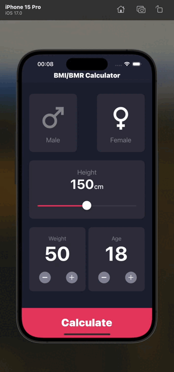

# BMI/BMR Calculator App



BMI/BMR Calculator App is an application developed in Swift using SwiftUI in Xcode 15. It allows users to calculate their Body Mass Index (BMI) and Basal Metabolic Rate (BMR) based on the input data.

## Features

- **BMI Calculation:** The app allows users to input their weight and height to calculate their BMI.
- **BMR Calculation:** Users can input their age, gender, weight, and height to calculate their BMR.
- **Simple and Intuitive Interface:** The app is designed with SwiftUI, ensuring simplicity and responsiveness.

## Installation

1. Clone the repository:
    ```bash
    git clone https://github.com/anikin02/BMI-BMR-CalculatorApp.git
    ```
2. Open the project in Xcode:
    ```bash
    cd BMI-BMR-CalculatorApp
    open BMI-BMR-CalculatorApp.xcodeproj
    ```
3. Run the project on a simulator or a real device.

